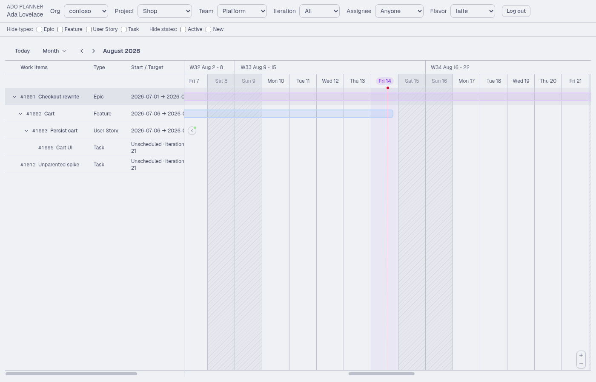

<p align="center">
  
</p>

<h1 align="center">ADO Planner</h1>

<p align="center"><strong>See the plan. Drag the dates. Azure DevOps stays in sync.</strong></p>

<p align="center">
  A Monday-style Gantt for your Azure DevOps Team — Epic down to Task, on one timeline,<br>
  with dates that write back when you move them. Built for PMs, engineering managers, and anyone<br>
  tired of exporting the backlog to a spreadsheet.
</p>

<p align="center">
  <a href="https://github.com/codeviking428/ado-planner/releases/latest"></a>
  
  
  
</p>

<p align="center">
  <a href="https://github.com/codeviking428/ado-planner/releases/latest"><strong>Download for Windows or Linux</strong></a>
  ·
  <a href="#install-with-npm">Install with npm</a>
  ·
  <a href="#sign-in">Sign in</a>
</p>



## Why teams use it

Azure DevOps is the system of record. It is not a planning board. ADO Planner is the missing timeline:

- **One Team, one picture** — pick org, project, and Team. The Epic → Feature → Story → Task tree shows up on a Gantt.
- **Drag to reschedule** — move a bar, or pull an edge. Start Date and Target Date PATCH back to Azure DevOps on release.
- **Filter without leaving** — sprint, assignee, work-item type, state. Hide the noise, keep the plan.
- **Open the real item** — double-click a row or bar to edit the Work Item form (the same layout pages ADO uses), then save.

No browser tabs, no CSV round-trips, no second tool that drifts out of date.

## Install

### Windows & Linux (the usual way)

1. Open the <a href="https://github.com/codeviking428/ado-planner/releases/latest">latest release</a>.
2. **Windows:** download `ado-planner-*-setup.exe` and run it. It installs per-user — no admin prompt. You'll get a Start Menu and desktop shortcut.
3. **Linux:** download `ado-planner-*.AppImage`, mark it executable (`chmod +x ado-planner-*.AppImage`), and run it.

The installed app checks for updates on launch. Yes downloads, installs, and restarts; No snoozes until next time.

macOS is not supported.

### Install with npm

If you already have [Node.js 20+](https://nodejs.org) (and Git), install the app globally from this repo:

```bash
npm install -g github:codeviking428/ado-planner
ado-planner
```

That's it — no clone, no `pnpm`, no build step on your side. Update with the same command; remove with `npm uninstall -g ado-planner`.

> The npm install talks to Azure DevOps the same way the installer does. It does **not** auto-update itself — re-run the `npm install -g` command when you want a new version.

## Sign in

The app calls Azure DevOps **as you**. Start with a personal access token (no admin required). Switch to Entra SSO later if your tenant wants it.

### Personal access token — works today

If no Entra app ID is configured (the default), ADO Planner asks for a PAT at startup.

1. In Azure DevOps: **User settings → Personal access tokens → New Token**.
2. Scopes: **Work Items (Read & Write)** and **Project and Team (Read)**. Full access is fine too.
3. Paste the token into the sign-in screen and click **Continue**.

The token is stored with Electron `safeStorage` on your machine. On Linux without a secret store it stays in memory only, so you'll paste it again next launch. **Log out** wipes it.

### Entra work/school SSO — one-time admin setup

An Entra admin registers **one public-client app** for the whole org. It is not a secret. End users never register their own.

1. [Entra admin center](https://entra.microsoft.com) → **App registrations → New registration**.
2. Supported account types: **Accounts in any organizational directory** (not personal Microsoft accounts).
3. **Add a platform → Mobile and desktop applications**, redirect URI `http://localhost`.
4. **Authentication → Allow public client flows: Yes**.
5. **API permissions → Azure DevOps** (delegated, not Microsoft Graph):
   - `vso.work` + `vso.work_write` — hierarchy, drag-to-save, form save
   - `vso.project` — projects and Teams
   - `vso.profile` — organization listing
6. Do **not** add a client secret.
7. Put the Application (client) ID in `ENTRA_CLIENT_ID` / `MAIN_VITE_ENTRA_CLIENT_ID` (see [Development](#development)).

Sign-in opens the system browser (MSAL public client, PKCE, loopback). The Session is stored with `safeStorage`; on Linux `basic_text` it is memory-only.

## Using ADO Planner

Pick **Org → Project → Team** in the header. The Gantt loads that Team's Work Item Hierarchy.

| You want to…                 | Do this                                                         |
| ---------------------------- | --------------------------------------------------------------- |
| Scope to a sprint            | **Iteration** dropdown (or leave **All**)                       |
| See only your items          | **Assignee → Me** (or **Unassigned**)                           |
| Hide clutter                 | Check **Hide types** / **Hide states**                          |
| Move work in time            | Drag a bar; Start + Target save together                        |
| Change just the finish       | Drag the bar's right edge (left edge changes Start)             |
| Nudge a day at a time        | Focus a bar, then **←** / **→**                                 |
| Cancel a drag                | **Escape**                                                      |
| Edit title, state, assignee… | Double-click a bar or a Work Item row                           |
| Jump around the timeline     | **Today**, **‹ ›**, scale (Day → Year), and **+ −** zoom        |
| Switch light/dark            | **Flavor** — Catppuccin `latte`, `frappe`, `macchiato`, `mocha` |
| Sign out                     | **Log out** — clears the stored Session / PAT                   |

Items without Start/Target date fields can't be dragged (you'll get a toast). They show an `Unscheduled` hint from their iteration dates instead.

The Work Item dialog uses that type's layout pages as tabs. Edit, **Save**, done — it PATCHes Azure DevOps.

## Development

Contributors working on the app itself:

```bash
git clone https://github.com/codeviking428/ado-planner.git
cd ado-planner
pnpm install
cp .env.example .env   # set ENTRA_CLIENT_ID, or leave empty for the PAT prompt
pnpm dev
```

| Variable                                        | Purpose                                                            |
| ----------------------------------------------- | ------------------------------------------------------------------ |
| `ENTRA_CLIENT_ID` / `MAIN_VITE_ENTRA_CLIENT_ID` | Public Entra client ID for SSO. Leave empty to fall back to a PAT. |

```bash
pnpm test          # Vitest
pnpm typecheck
pnpm lint
pnpm format
pnpm e2e           # Playwright `_electron` against a loopback ADO mock
pnpm build:win     # NSIS installer (per-user)
pnpm build:linux   # AppImage
```

Linux e2e without a desktop session: `xvfb-run -a pnpm e2e`.

Pushing a `v*.*.*` tag publishes a GitHub Release with the Windows installer and Linux AppImage. Packaged builds auto-update from that feed (`electron-updater`, `autoDownload: false`).

## Spec

Locked on the [Monday-lite ADO Gantt spec](https://github.com/codeviking428/ado-planner/issues/1).
