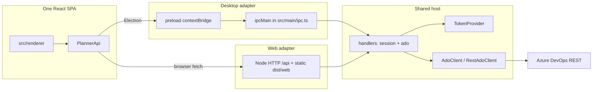

# Hybrid SPA + Electron

> Research note. Not an ADR. Written 2026-08-14.
> Path: `docs/hybrid-spa-electron.md` (no prior research-notes convention; this path was specified for the note).

## Verdict

Keep one React renderer and one privileged host. Implement `PlannerApi` twice: Electron preload (`contextBridge` + `ipcRenderer.invoke`) as today, and a same-origin `fetch` client for the browser. Do **not** run a local HTTP server inside Electron, and do **not** call Azure DevOps REST from the browser.

Extract host logic (the `TokenProvider` + `AdoClient`/`RestAdoClient` + the functions behind `registerIpc`) into a transport-agnostic module. Electron stays the IPC adapter; a new Node HTTP server is the web adapter. Tokens, PATs, and ADO Authorization headers stay on the host.

Build two artifacts from this repo: `electron-vite build` → `out/` for desktop (unchanged); a **second Vite config** plus `tsc` for the web SPA + Node server → `dist/web` + `dist/server`. electron-vite cannot produce a production web SPA by itself (`--rendererOnly` is a **dev** flag only). electron-builder continues to package `out/` only; it must not include `dist/`.

## Current seams

Today the renderer is already a SPA. The coupling is `window.planner` (Electron-only) and Electron APIs in main.

| Layer          | Modules                                                                                                                                                                                                                           | Host-agnostic?                                                                                                                                                   |
| -------------- | --------------------------------------------------------------------------------------------------------------------------------------------------------------------------------------------------------------------------------- | ---------------------------------------------------------------------------------------------------------------------------------------------------------------- |
| UI             | `src/renderer/` (`App.tsx`, Gantt, form). All data via `window.planner.*`                                                                                                                                                         | Almost. Depends on preload injecting `Window.planner`. No Electron imports.                                                                                      |
| Contract       | `PlannerApi` in `src/preload/index.ts`; Zod payloads in `src/shared/ipc.ts`; DTOs in `src/shared/types.ts`                                                                                                                        | Types/schemas yes. The `PlannerApi` **type** lives next to the Electron implementation.                                                                          |
| Preload        | `src/preload/index.ts` — `contextBridge.exposeInMainWorld('planner', api)` wrapping `ipcRenderer.invoke` / `.on`                                                                                                                  | Electron-only.                                                                                                                                                   |
| IPC handlers   | `src/main/ipc.ts` — `ipcMain.handle('session:*' \| 'ado:*' \| 'updater:*')`, Zod parse, then `AdoClient`/`RestAdoClient`                                                                                                          | Logic is reusable. `ipcMain` is not.                                                                                                                             |
| ADO            | `src/main/ado-client.ts`, `ado-rest.ts`, `ado-auth.ts` — `TokenProvider` in, REST/SDK out                                                                                                                                         | Yes, if `TokenProvider` stays. Uses `process.env` for base URLs (`ADO_PLANNER_ADO_BASE_URL`).                                                                    |
| Session        | `src/main/session.ts` (`TokenProvider`, Entra `PublicClientApplication`, `safeStorage`, `shell.openExternal`); `pat-session.ts` (`CacheStore`); `msal-cache.ts`; `auth-mode.ts` (`ENTRA_CLIENT_ID` / `MAIN_VITE_ENTRA_CLIENT_ID`) | `TokenProvider` + `createPatTokenProvider` + `CacheStore` are reusable. `safeStorage`, `app.getPath`, `shell`, `session.fromPartition`, `BrowserWindow` are not. |
| Desktop chrome | `src/main/index.ts` (`BrowserWindow`, `sandbox: true`, `contextIsolation: true`, `nodeIntegration: false`); `updater.ts` (`electron-updater`)                                                                                     | Electron-only.                                                                                                                                                   |
| Shared helpers | `src/shared/{dates,form-layout,hierarchy,organization-url,overlays,flavor}.ts`                                                                                                                                                    | Yes.                                                                                                                                                             |
| Build          | `electron.vite.config.ts` (main / preload / renderer); `electron-builder.yml` (NSIS + AppImage, `docs/` excluded); `bin/ado-planner.cjs` spawns Electron against `out/main/index.js`                                              | Desktop-only.                                                                                                                                                    |

`PlannerApi` surface that both hosts must implement:

- `session.get` / `login` / `logout`
- `ado.orgs` / `projects` / `teams` / `iterations` / `hierarchy` / `patchDates` / `form` / `saveForm` / `identities`
- `updater.prompt` / `apply` / `snooze` / `onAvailable` / `onError` — **no-op on web**

## Recommended architecture

**Ports and adapters.** Extract the privileged host from Electron. Electron IPC and Node HTTP are two adapters over the same application service. Do not make Electron load a local HTTP server.

Why this, not “Electron wraps HTTP”:

1. Electron’s process model is main (Node, privileged) + renderer (web standards, no Node) + preload as the bridge. IPC is the supported privileged channel. [[1]](https://www.electronjs.org/docs/latest/tutorial/process-model) [[2]](https://www.electronjs.org/docs/latest/tutorial/tutorial-preload)
2. electron-vite does not support `nodeIntegration` and tells you to keep Node out of the renderer. [[3]](https://electron-vite.org/guide/dev.html)
3. A localhost HTTP server inside Electron is reachable by **any local process** unless you add a second auth layer. IPC is not. Electron’s security tutorial also prefers local packaged content over loading remote/HTTP UI with privileged APIs. [[4]](https://www.electronjs.org/docs/latest/tutorial/security)
4. Desktop already has the right split (`registerIpc` + `TokenProvider` + `AdoClient`). HTTP-inside-Electron would duplicate transport without removing Electron coupling (`safeStorage`, `BrowserWindow`, `electron-updater`).



`PlannerApi` implemented twice:

| Method                 | Desktop (`src/preload/index.ts`)                  | Web (new `src/renderer/src/planner-http.ts`)                                                         |
| ---------------------- | ------------------------------------------------- | ---------------------------------------------------------------------------------------------------- |
| `session.get()`        | `ipcRenderer.invoke('session:get')`               | `GET /api/session` with `credentials: 'include'`                                                     |
| `session.login(creds)` | `invoke('session:login', creds)`                  | PAT: `POST /api/session/login`. Entra: navigate to `GET /auth/login` (server starts auth-code flow). |
| `session.logout()`     | `invoke('session:logout')`                        | `POST /api/session/logout`                                                                           |
| `ado.*`                | `invoke('ado:…')` with the same payloads as today | `POST /api/ado/…` JSON body; server runs the **same** Zod schemas from `src/shared/ipc.ts`           |
| `updater.*`            | real `electron-updater` IPC                       | no-op: `prompt() => null`, empty listeners                                                           |

Move the `PlannerApi` type to `src/shared/` (or keep exporting it from preload and have the HTTP client implement that type). `src/preload/index.d.ts` can keep augmenting `Window.planner` for both builds.

Map today’s IPC channels 1:1 to HTTP so handlers stay copy-pasteable:

| IPC channel       | HTTP                                                |
| ----------------- | --------------------------------------------------- |
| `session:get`     | `GET /api/session`                                  |
| `session:login`   | `POST /api/session/login`                           |
| `session:logout`  | `POST /api/session/logout`                          |
| `ado:orgs`        | `POST /api/ado/orgs`                                |
| `ado:projects`    | `POST /api/ado/projects` `{ org }`                  |
| `ado:teams`       | `POST /api/ado/teams` `{ org, project }`            |
| `ado:iterations`  | `POST /api/ado/iterations` `{ org, project, team }` |
| `ado:hierarchy`   | `POST /api/ado/hierarchy` `scopeSchema`             |
| `ado:patch-dates` | `POST /api/ado/patch-dates` `patchDatesSchema`      |
| `ado:form`        | `POST /api/ado/form` `openFormSchema`               |
| `ado:save-form`   | `POST /api/ado/save-form` `saveFormSchema`          |
| `ado:identities`  | `POST /api/ado/identities` `searchIdentitiesSchema` |

POST-for-reads is intentional: it matches existing IPC payloads (objects, not URL design) and avoids putting org/query strings in the URL. Same-origin + session cookie is the authn; Zod remains the validation.

Suggested layout (implement later; not done in this note):

```
src/host/          TokenProvider, handlers, AdoClient (moved from src/main)
src/main/          Electron adapter: BrowserWindow, registerIpc, safeStorage store, updater
src/server/        Node HTTP adapter: cookies, /auth/*, static files
src/preload/       Electron PlannerApi
src/renderer/      React SPA + optional HTTP PlannerApi injector
src/shared/        Zod, types, PlannerApi type
```

## Web host (SPA + server)

### Why a server is required

The browser cannot be the ADO client for this app.

1. **CORS.** Azure DevOps REST lives at `https://dev.azure.com/{org}/_apis/...`. [[5]](https://learn.microsoft.com/en-us/azure/devops/integrate/how-to/call-rest-api) A SPA on another origin that sends `Authorization` is not a CORS “simple request”; the browser preflights and the **ADO origin** must allow the SPA origin. [[6]](https://developer.mozilla.org/en-US/docs/Web/HTTP/Guides/CORS) Microsoft does not document CORS for third-party browser origins on Azure DevOps REST. The documented in-browser REST path is Azure DevOps **extensions** (host SDK / `getAccessToken()`), which this app is not. [[7]](https://learn.microsoft.com/en-us/azure/devops/extend/develop/auth) Official getting-started samples use curl / server `HttpClient`, not `fetch` from a third-party SPA. [[5]](https://learn.microsoft.com/en-us/azure/devops/integrate/how-to/call-rest-api)

2. **PAT in JS.** A PAT is an alternate password; treat it like one; keep it confidential. [[8]](https://learn.microsoft.com/en-us/azure/devops/organizations/accounts/use-personal-access-tokens-to-authenticate) Putting it in `localStorage` or renderer memory makes it available to XSS. Vite also warns that `VITE_*` values are bundled into client code — never put PATs or client secrets there. [[9]](https://vite.dev/guide/env-and-mode)

3. **Entra client type.** Desktop today is a **public client** (`@azure/msal-node` `PublicClientApplication`, redirect `http://localhost`, PKCE, system browser). [[10]](https://github.com/AzureAD/microsoft-authentication-library-for-js/blob/dev/lib/msal-node/README.md) A browser SPA that acquired tokens itself would use `@azure/msal-browser` (public client, `spa` redirect URI, tokens in the page). [[11]](https://github.com/AzureAD/microsoft-authentication-library-for-js/blob/dev/lib/msal-browser/README.md) That still leaves ADO REST in the browser (CORS) and puts tokens in the renderer, which this repo currently forbids. A Node-hosted UI is Entra’s **web app** type: server redeems the code, sets a session cookie, calls APIs. [[12]](https://learn.microsoft.com/en-us/entra/identity-platform/v2-app-types)

4. **What must stay on the server:** PAT and Entra access/refresh tokens; `Authorization` headers to ADO; `AdoClient` / `RestAdoClient`; session store. The renderer gets `SessionInfo` and work-item DTOs only.

### Auth (web)

Contrast with desktop `src/main/session.ts`:

|                       | Desktop now                                                                                                                                                        | Web host                                                                                                                                                                                                                                                                                    |
| --------------------- | ------------------------------------------------------------------------------------------------------------------------------------------------------------------ | ------------------------------------------------------------------------------------------------------------------------------------------------------------------------------------------------------------------------------------------------------------------------------------------- |
| Library               | `@azure/msal-node` `PublicClientApplication`                                                                                                                       | Same package, `ConfidentialClientApplication`                                                                                                                                                                                                                                               |
| Proof of app identity | None (public client; no secret). [[13]](https://learn.microsoft.com/en-us/entra/identity-platform/msal-client-applications)                                        | Client secret or certificate, server-only. Public clients must not use secrets. [[14]](https://learn.microsoft.com/en-us/entra/identity-platform/v2-oauth2-auth-code-flow)                                                                                                                  |
| Redirect              | Mobile and desktop platform, `http://localhost`. README already documents this.                                                                                    | **Web** platform redirect, e.g. `https://<host>/auth/callback`. Do not reuse the `spa` redirect type — Entra rejects non-SPA flows that use a `spa` URI, and `spa` refresh tokens expire in 24h. [[14]](https://learn.microsoft.com/en-us/entra/identity-platform/v2-oauth2-auth-code-flow) |
| Interactive           | `acquireTokenInteractive({ openBrowser: shell.openExternal })`                                                                                                     | 302 to Entra `/authorize`; server redeems `code` on `/auth/callback`                                                                                                                                                                                                                        |
| Token storage         | `safeStorage.encryptString` files under `app.getPath('userData')/session` (`pat.bin` / `msal.bin`) [[15]](https://www.electronjs.org/docs/latest/api/safe-storage) | Server-side session (memory or encrypted files / later Redis). Browser gets `Set-Cookie` **HttpOnly; Secure; SameSite=Lax** (or `Strict`). [[16]](https://developer.mozilla.org/en-US/docs/Web/HTTP/Reference/Headers/Set-Cookie)                                                           |
| PAT                   | `createPatTokenProvider` writes JSON through `CacheStore`                                                                                                          | `POST /api/session/login` `{ pat, organization }`; store on server; never echo the PAT                                                                                                                                                                                                      |
| Logout                | wipe MSAL cache, `session.fromPartition`, `BrowserWindow` storage                                                                                                  | destroy server session, `Set-Cookie` Max-Age=0, optional Entra logout redirect                                                                                                                                                                                                              |

Do **not** add `@azure/msal-browser` to the renderer if the invariant is “tokens never in the renderer.” msal-browser is for SPAs **without** a backend. [[11]](https://github.com/AzureAD/microsoft-authentication-library-for-js/blob/dev/lib/msal-browser/README.md) Microsoft also: do not forward confidential-client tokens to a public client. [[13]](https://learn.microsoft.com/en-us/entra/identity-platform/msal-client-applications)

Entra app registration: prefer a **second** app (Web + secret) rather than hanging a client secret on the existing public-client desktop app (`Allow public client flows: Yes`, no secret). Same Azure DevOps delegated scopes (`499b84ac-1321-427f-aa17-267ca6975798`, `.default` as today in `src/shared/types.ts`). [[17]](https://learn.microsoft.com/en-us/azure/devops/integrate/get-started/authentication/entra-oauth) If you insist on one registration, adding a Web redirect is allowed, but a secret on an app that also enables public-client flows is a worse threat model.

PAT remains valid for personal/legacy use; Microsoft recommends Entra for production apps. [[18]](https://learn.microsoft.com/en-us/azure/devops/integrate/get-started/authentication/authentication-guidance)

`createPatTokenProvider` already takes a `CacheStore`. Web implements `CacheStore` without `safeStorage` (OS DPAPI/Keychain is Electron-only). [[15]](https://www.electronjs.org/docs/latest/api/safe-storage)

### Cookies, CSRF, CORS (your origin)

Serve the SPA **and** `/api` from the same origin in production (Node static + API). Then the browser’s cross-origin rules do not apply between UI and host. [[6]](https://developer.mozilla.org/en-US/docs/Web/HTTP/Guides/CORS)

- Session cookie: `HttpOnly` (no `document.cookie`), `Secure` on HTTPS, `SameSite=Lax` (blocks cross-site POST, allows top-level GET so Entra redirect can complete). [[16]](https://developer.mozilla.org/en-US/docs/Web/HTTP/Reference/Headers/Set-Cookie)
- Fetch: `credentials: 'include'`.
- CSRF: `SameSite=Lax` is the main control. Optionally require a custom header on `/api` mutations so a cross-site form cannot POST. Do not set `SameSite=None` unless you have a real cross-site need.
- Dev: Vite `server.proxy` `/api` and `/auth` to the Node port so the browser still sees one origin, or run Vite in `middlewareMode` behind the Node server (one port). [[19]](https://vite.dev/config/server-options)
- Do not set Vite `server.cors: true` (any origin can pull source). [[19]](https://vite.dev/config/server-options)

Bind the Node server to loopback for local-only deploys; use HTTPS + `Secure` cookies when exposed.

### What the server reuses

Reuse as-is: `AdoClient`, `RestAdoClient`, `adoAuthorizationHeader`, `createPatTokenProvider`, `createMsalCachePlugin`, Zod schemas, `buildFormPatch` / `buildStartTargetPatch`, `TokenProvider`.

New: HTTP router that calls the same functions `registerIpc` already calls; cookie session; `ConfidentialClientApplication` + `acquireTokenByCode`; static file server for `dist/web`.

## Desktop host (Electron)

Leave the process model and security flags as they are in `src/main/index.ts`:

```ts
webPreferences: {
  preload: join(__dirname, '../preload/index.js'),
  sandbox: true,
  contextIsolation: true,
  nodeIntegration: false
}
```

That matches Electron’s checklist: no Node in the renderer, context isolation on, sandbox on, do not disable `webSecurity`, do not load remote content with Node. [[4]](https://www.electronjs.org/docs/latest/tutorial/security) [[20]](https://www.electronjs.org/docs/latest/tutorial/context-isolation)

Preload continues to expose **one function per channel**, not raw `ipcRenderer`. That is the documented safe pattern; exposing `ipcRenderer.send` wholesale is called out as unsafe. [[20]](https://www.electronjs.org/docs/latest/tutorial/context-isolation) [[2]](https://www.electronjs.org/docs/latest/tutorial/tutorial-preload)

After the host extract, `src/main/ipc.ts` becomes a thin `ipcMain.handle` wrapper around shared handlers. `createSessionTokenProvider` keeps `safeStorage` + `shell.openExternal`. `updater.ts` stays desktop-only (`electron-updater` downloads NSIS/AppImage artifacts and calls `quitAndInstall` — that has no meaning in a browser). [[21]](https://www.electron.build/docs/features/auto-update/)

`bin/ado-planner.cjs` and `build:win` / `build:linux` stay the Electron path.

## Build

### Can electron-vite build the renderer alone for web?

**No, not as a production web artifact.**

- `electron-vite build` always builds main + preload + renderer. [[22]](https://electron-vite.org/guide/cli)
- `--rendererOnly` exists only on **`dev`**, to skip rebuilding main/preload. It is not a web production mode. [[22]](https://electron-vite.org/guide/cli)
- Renderer built-ins are Electron-specific: `root` = `src/renderer`, `build.outDir` = `out/renderer`, `build.target` = Electron’s Chrome (`chrome*`), `modulePreload.polyfill` = `false`, `envPrefix` = `RENDERER_VITE_` and `VITE_`. [[23]](https://electron-vite.org/config/)
- `electron.vite.config.ts` is `{ main, preload, renderer }`, not a Vite `UserConfig`. `vite build -c electron.vite.config.ts` will not work.

Use a **second Vite config** (`vite.config.web.ts`) that copies the renderer aliases/plugins (`react()`, `tailwindcss()`, `@` / `@renderer` / `@shared`) with:

- `root: 'src/renderer'` (same HTML entry `index.html` → `src/main.tsx`)
- `build.outDir: resolve('dist/web')` (absolute, so it is not `src/renderer/dist`)
- Default Vite browser `build.target` (Baseline Widely Available), not Electron `chrome*` [[24]](https://vite.dev/guide/build)
- `envPrefix: 'VITE_'` (and optionally `RENDERER_VITE_` if you share vars)
- `server.proxy` for `/api` and `/auth` in web **dev** [[19]](https://vite.dev/config/server-options)
- `base: '/'` (Node serves the app at `/`). Relative `base` is for unknown static paths; not needed if the server owns `/`. [[24]](https://vite.dev/guide/build)

`vite build --mode web` is how you pick `.env.web` / `.env.web.local`. Mode is not a substitute for a second config. [[9]](https://vite.dev/guide/env-and-mode)

### How to compile the Node server

**Do not reuse the electron-vite main target.** Main is Vite SSR with `ssr.noExternal: true`, externals = `electron` + Node builtins, `build.target` = Electron’s Node, output `out/main`. [[23]](https://electron-vite.org/config/) `session.ts` still `import`s `electron`. That bundle is not a standalone Node process.

Use **`tsc -p tsconfig.server.json`** (this repo already typechecks with `tsc`). Emit `dist/server/` with `module: NodeNext`, `outDir: dist/server`, include `src/server/**` + the extracted host modules + `src/shared/**`. Keep `electron` out of that graph.

Alternative: esbuild `--platform=node --packages=external` into `dist/server/index.js`. Fine; tsc is enough and matches `typecheck:node`.

Do not put the server through Vite library mode (that is for browser libraries). [[24]](https://vite.dev/guide/build)

### Recommended `package.json` scripts

```json
{
  "dev": "electron-vite dev",
  "dev:web": "tsc -p tsconfig.server.json --watch & vite --config vite.config.web.ts --mode web",
  "build": "pnpm typecheck && electron-vite build",
  "build:web": "pnpm typecheck && tsc -p tsconfig.server.json && vite build --config vite.config.web.ts --mode web",
  "start:web": "node dist/server/index.js",
  "build:win": "pnpm build && electron-builder --win",
  "build:linux": "electron-vite build && electron-builder --linux"
}
```

Keep `dev` / `build` / `build:win` / `build:linux` meaning **desktop**. Add `dev:web` / `build:web` / `start:web`. Use `concurrently` or a tiny `node` script instead of `&` on Windows (this machine is Windows).

`typecheck:web` today is the **renderer** tsconfig name, not the browser flavor. Leave it. Add `typecheck:server` if you add `tsconfig.server.json`.

### electron-builder: include / exclude

Current `electron-builder.yml` `files` already drops `src/`, `e2e/`, `docs/`, `scripts/`, `.github/`, configs. Defaults still add `package.json` and production `node_modules`. [[25]](https://www.electron.build/configuration.html)

Add explicit ignores so the web artifact never ships inside NSIS/AppImage:

```yaml
files:
  - '!dist/*'
  - '!vite.config.web.ts'
  - '!tsconfig.server.json'
```

Keep packaging `out/main`, `out/preload`, `out/renderer`, `resources/`. Do not set `files` to a custom non-ignore list without repeating defaults — custom positive globs **replace** `**/*`. [[25]](https://www.electron.build/configuration.html)

`package.json` `"files"` for the npm global CLI (`bin`, `out`, `resources`, `scripts`) should stay Electron-only. Do not add `dist/` there unless you publish a separate `ado-planner-web` package.

### Env prefixes

| Prefix                   | Where                                                                                                                                           | This repo today                                       | Web                                                                                   |
| ------------------------ | ----------------------------------------------------------------------------------------------------------------------------------------------- | ----------------------------------------------------- | ------------------------------------------------------------------------------------- |
| `MAIN_VITE_*`            | electron-vite **main** only [[26]](https://electron-vite.org/guide/env-and-mode)                                                                | `MAIN_VITE_ENTRA_CLIENT_ID` via `auth-mode.ts`        | Unused. Server reads `process.env`.                                                   |
| `PRELOAD_VITE_*`         | preload only [[26]](https://electron-vite.org/guide/env-and-mode)                                                                               | unused                                                | unused                                                                                |
| `RENDERER_VITE_*`        | renderer only [[26]](https://electron-vite.org/guide/env-and-mode)                                                                              | unused                                                | optional                                                                              |
| `VITE_*`                 | all electron-vite processes **and** Vite client [[26]](https://electron-vite.org/guide/env-and-mode) [[9]](https://vite.dev/guide/env-and-mode) | do not put secrets here                               | Public flags only, e.g. `VITE_HOST=web`. **Never** PAT, Entra secret, session secret. |
| unprefixed `process.env` | Node at runtime                                                                                                                                 | `ENTRA_CLIENT_ID`, `ADO_PLANNER_*`, `ADO_PLANNER_E2E` | `ENTRA_CLIENT_ID`, `ENTRA_CLIENT_SECRET`, `SESSION_SECRET`, `ADO_PLANNER_*`, `PORT`   |

electron-vite `dev`/`build` modes: `development` vs `production`; `--mode` overrides. [[26]](https://electron-vite.org/guide/env-and-mode)

### Output dirs

| Artifact                          | Dir                                                                                                                                                                                                                                                                                                                                                      | Tool                                     |
| --------------------------------- | -------------------------------------------------------------------------------------------------------------------------------------------------------------------------------------------------------------------------------------------------------------------------------------------------------------------------------------------------------- | ---------------------------------------- |
| Desktop main / preload / renderer | `out/main`, `out/preload`, `out/renderer` (electron-vite default) [[27]](https://electron-vite.org/guide/build)                                                                                                                                                                                                                                          | `electron-vite build`                    |
| Web SPA                           | `dist/web`                                                                                                                                                                                                                                                                                                                                               | `vite build --config vite.config.web.ts` |
| Node server JS                    | `dist/server`                                                                                                                                                                                                                                                                                                                                            | `tsc -p tsconfig.server.json`            |
| Installers                        | electron-builder `dist/` **by default** for NSIS/AppImage — this repo does not set `directories.output`, so **name the Vite outDir `dist/web`**, not `dist`, or set electron-builder `directories.output` to `release/` so the two `dist` trees never clash. Prefer `directories.output: release` in `electron-builder.yml` if you introduce `dist/web`. |

`package.json` `"main": "./out/main/index.js"` stays the Electron entry.

### CI

`.github/workflows/ci.yml`: lint, typecheck, test — add `pnpm build:web` (or `typecheck:server`) so the web graph does not rot.

`.github/workflows/release.yml`: still `pnpm build && electron-builder --win/--linux --publish always`. Do not attach `dist/web` to GitHub Releases unless you add a separate job. `electron-updater` consumes `latest.yml` next to NSIS/AppImage; a zip of the SPA is not an auto-update target. [[21]](https://www.electron.build/docs/features/auto-update/)

## Runtime detection

Renderer must not `import 'electron'`. electron-vite will not polyfill Node in the renderer. [[3]](https://electron-vite.org/guide/dev.html)

Official Electron pattern: preload `contextBridge.exposeInMainWorld('planner', api)`; renderer uses `window.planner`. [[2]](https://www.electronjs.org/docs/latest/tutorial/tutorial-preload) [[20]](https://www.electronjs.org/docs/latest/tutorial/context-isolation) TypeScript: augment `Window` (already `src/preload/index.d.ts`).

Web: there is no preload. In `src/renderer/src/main.tsx`, before `createRoot`:

```ts
if (window.planner == null) {
  window.planner = createHttpPlannerApi()
}
```

Detection is “did preload run?”, not user-agent. Desktop builds always inject `planner`. Web builds never include preload.

Optional compile-time flag `import.meta.env.VITE_HOST === 'web'` (set in `.env.web`) for tree-shaking the HTTP client vs assuming preload. Do not put secrets in that file. [[9]](https://vite.dev/guide/env-and-mode)

Updater: HTTP `PlannerApi.updater` returns `null`, no-ops `apply`/`snooze`, and `onAvailable`/`onError` return an empty unsubscribe. Same shape as `createUpdaterBridge` when `!isPackaged`. Hide the update UI when `prompt` is always null (App.tsx already can).

## Security

**Electron (keep):** sandbox, contextIsolation, nodeIntegration false, local `loadFile` / `ELECTRON_RENDERER_URL` only in dev, `setWindowOpenHandler` → `shell.openExternal`. Do not disable `webSecurity`. Do not enable Node for remote content. [[4]](https://www.electronjs.org/docs/latest/tutorial/security)

**Web:** same-origin SPA+API; HttpOnly session cookie; CSRF via SameSite (+ optional custom header); HTTPS in production; CSP in `src/renderer/index.html` is already `default-src 'self'` — keep it for web (Entra login is a **top-level navigation**, not a `fetch` to login.microsoftonline.com). If web CSP needs `connect-src 'self'` only, that is correct because ADO is not called from JS.

**Both:** tokens never in the renderer; Zod at the host boundary; PAT treated as a password. [[8]](https://learn.microsoft.com/en-us/azure/devops/organizations/accounts/use-personal-access-tokens-to-authenticate)

## What NOT to do

1. **Electron in the browser / “run Electron as a SPA.”** Electron is a desktop process model, not a browser library. [[1]](https://www.electronjs.org/docs/latest/tutorial/process-model)
2. **`nodeIntegration: true` or Node in the renderer.** electron-vite does not support it; Electron security forbids it for anything that isn’t fully trusted local code. [[3]](https://electron-vite.org/guide/dev.html) [[4]](https://www.electronjs.org/docs/latest/tutorial/security)
3. **Expose `ipcRenderer` on `window`.** Wrap per channel. [[20]](https://www.electronjs.org/docs/latest/tutorial/context-isolation)
4. **PAT or Entra tokens in `localStorage` / `document.cookie` (non-HttpOnly).** PAT is a password. [[8]](https://learn.microsoft.com/en-us/azure/devops/organizations/accounts/use-personal-access-tokens-to-authenticate) HttpOnly exists to block JS access. [[16]](https://developer.mozilla.org/en-US/docs/Web/HTTP/Reference/Headers/Set-Cookie)
5. **Call ADO REST from the browser** in this architecture. Undocumented CORS; `Authorization` preflight; tokens in the page. [[5]](https://learn.microsoft.com/en-us/azure/devops/integrate/how-to/call-rest-api) [[6]](https://developer.mozilla.org/en-US/docs/Web/HTTP/Guides/CORS)
6. **`@azure/msal-browser` in the renderer** while also running a confidential Node host — that is the “SPA without backend” library and moves tokens into the page. [[11]](https://github.com/AzureAD/microsoft-authentication-library-for-js/blob/dev/lib/msal-browser/README.md) [[13]](https://learn.microsoft.com/en-us/entra/identity-platform/msal-client-applications)
7. **`spa` redirect URI for the Node callback.** Wrong app type; 24h refresh-token cap. [[14]](https://learn.microsoft.com/en-us/entra/identity-platform/v2-oauth2-auth-code-flow)
8. **Client secret in `VITE_*` / renderer.** Vite inlines `VITE_*` into the client bundle. [[9]](https://vite.dev/guide/env-and-mode) Confidential secrets stay on the server. [[14]](https://learn.microsoft.com/en-us/entra/identity-platform/v2-oauth2-auth-code-flow)
9. **Load the web origin inside Electron with the privileged preload.** That is remote content + extra powers. [[4]](https://www.electronjs.org/docs/latest/tutorial/security)
10. **Ship `dist/web` or the HTTP server inside electron-builder.** Different runtime; updater metadata is for NSIS/AppImage. [[21]](https://www.electron.build/docs/features/auto-update/) [[25]](https://www.electron.build/configuration.html)
11. **Disable `webSecurity` to “fix CORS” against `dev.azure.com`.** Explicitly forbidden in production. [[4]](https://www.electronjs.org/docs/latest/tutorial/security)

## What cannot be shared

| Stay Electron-only                                              | Why                                                                                                                    |
| --------------------------------------------------------------- | ---------------------------------------------------------------------------------------------------------------------- |
| `safeStorage`                                                   | OS keychain/DPAPI; not in Node/browser. [[15]](https://www.electronjs.org/docs/latest/api/safe-storage)                |
| `app`, `BrowserWindow`, `shell`, `session`, `dialog`, `ipcMain` | Main-process Electron APIs. [[1]](https://www.electronjs.org/docs/latest/tutorial/process-model)                       |
| `src/preload/*`                                                 | `contextBridge` / `ipcRenderer`. [[2]](https://www.electronjs.org/docs/latest/tutorial/tutorial-preload)               |
| `electron-updater` / `src/main/updater.ts`                      | Installer download + `quitAndInstall` for NSIS/AppImage. [[21]](https://www.electron.build/docs/features/auto-update/) |
| `bin/ado-planner.cjs`                                           | Spawns Electron against `out/main/index.js`.                                                                           |
| electron-vite main/preload targets                              | Bundle for Electron’s Node + `external: electron`. [[23]](https://electron-vite.org/config/)                           |

| Share                                       | Notes                                        |
| ------------------------------------------- | -------------------------------------------- |
| `PlannerApi` type                           | Move to `src/shared`.                        |
| `src/shared/ipc.ts` Zod                     | Both adapters parse with the same schemas.   |
| `AdoClient`, `RestAdoClient`, `ado-auth.ts` | Depend only on `TokenProvider`.              |
| `createPatTokenProvider` + `CacheStore`     | Swap `safeStorage` store for a server store. |
| `createMsalCachePlugin`                     | Persistence backend differs.                 |
| React renderer                              | Inject `window.planner`.                     |
| `auth-mode.ts` client-id helper             | Web also needs `ENTRA_CLIENT_SECRET` (new).  |

## Minimal change path

1. **Move `PlannerApi` to `src/shared/planner-api.ts`.** Preload implements it; `index.d.ts` still augments `Window`. No behavior change.

2. **Split `registerIpc`:** `src/host/handlers.ts` exports the functions (session get/login/logout, ado.\*) taking `TokenProvider` + ADO client. `src/main/ipc.ts` only binds `ipcMain.handle`. Keep Zod parse at the handler boundary.

3. **Stop importing Electron from reusable session code.** `createPatTokenProvider` is already clean. Extract Entra `PublicClientApplication` setup so `openBrowser` and cache `CacheStore` are injected. Leave `safeStorage` factory in `src/main/`.

4. **HTTP `PlannerApi` client** in the renderer: `fetch` + `credentials: 'include'`, same method names. Install it in `main.tsx` when `window.planner` is missing. Updater no-op.

5. **`vite.config.web.ts` + `dev:web`.** Confirm the SPA loads in a browser and fails on `/api` until the server exists (expected).

6. **`src/server/index.ts`:** `node:http`, cookie session, routes in the table above, static `dist/web` in production, Vite proxy or middlewareMode in dev. Reuse handlers from step 2. PAT login first (reuse `createPatTokenProvider`).

7. **Entra on the server:** `ConfidentialClientApplication`, Web redirect `/auth/callback`, secret from `process.env` (not `VITE_*`). Second Entra app registration. `session.login` in the HTTP client redirects the window for `authMode === 'entra'`.

8. **Scripts and ignores:** `build:web`, `start:web`; electron-builder `!dist/*`; consider `directories.output: release`. Do not change `build:win` / `build:linux` meaning.

9. **CI:** typecheck/build the web graph on PRs. Leave `release.yml` desktop-only.

10. **Do not** merge Electron and HTTP transports. Do not add msal-browser. Do not teach the renderer ADO URLs.

## Sources

1. [Electron process model](https://www.electronjs.org/docs/latest/tutorial/process-model)
2. [Electron: using preload scripts](https://www.electronjs.org/docs/latest/tutorial/tutorial-preload)
3. [electron-vite: Development](https://electron-vite.org/guide/dev.html) (preload, `nodeIntegration` unsupported, `--rendererOnly` note on CLI sibling)
4. [Electron security tutorial](https://www.electronjs.org/docs/latest/tutorial/security)
5. [Get started with Azure DevOps REST APIs](https://learn.microsoft.com/en-us/azure/devops/integrate/how-to/call-rest-api) (replaces the 404 URL `…/get-started/rest/rest-getting-started`)
6. [MDN: CORS](https://developer.mozilla.org/en-US/docs/Web/HTTP/Guides/CORS)
7. [Azure DevOps: authenticate from web extensions](https://learn.microsoft.com/en-us/azure/devops/extend/develop/auth)
8. [Use personal access tokens](https://learn.microsoft.com/en-us/azure/devops/organizations/accounts/use-personal-access-tokens-to-authenticate)
9. [Vite: Env Variables and Modes](https://vite.dev/guide/env-and-mode)
10. [@azure/msal-node README](https://github.com/AzureAD/microsoft-authentication-library-for-js/blob/dev/lib/msal-node/README.md)
11. [@azure/msal-browser README](https://github.com/AzureAD/microsoft-authentication-library-for-js/blob/dev/lib/msal-browser/README.md)
12. [Microsoft identity platform application types](https://learn.microsoft.com/en-us/entra/identity-platform/v2-app-types)
13. [MSAL public vs confidential clients](https://learn.microsoft.com/en-us/entra/identity-platform/msal-client-applications)
14. [Microsoft identity platform auth code flow](https://learn.microsoft.com/en-us/entra/identity-platform/v2-oauth2-auth-code-flow)
15. [Electron `safeStorage`](https://www.electronjs.org/docs/latest/api/safe-storage)
16. [MDN: `Set-Cookie`](https://developer.mozilla.org/en-US/docs/Web/HTTP/Reference/Headers/Set-Cookie)
17. [Build Azure DevOps integrations with Microsoft Entra OAuth](https://learn.microsoft.com/en-us/azure/devops/integrate/get-started/authentication/entra-oauth)
18. [Authentication methods for Azure DevOps integrations](https://learn.microsoft.com/en-us/azure/devops/integrate/get-started/authentication/authentication-guidance)
19. [Vite server options](https://vite.dev/config/server-options) (`server.proxy`, `server.cors`, `middlewareMode`)
20. [Electron context isolation](https://www.electronjs.org/docs/latest/tutorial/context-isolation)
21. [electron-builder auto-update (`electron-updater`)](https://www.electron.build/docs/features/auto-update/)
22. [electron-vite CLI](https://electron-vite.org/guide/cli)
23. [electron-vite config (built-in main/preload/renderer)](https://electron-vite.org/config/)
24. [Vite: Building for Production](https://vite.dev/guide/build)
25. [electron-builder configuration (`files`)](https://www.electron.build/configuration.html)
26. [electron-vite: Env Variables and Modes](https://electron-vite.org/guide/env-and-mode)
27. [electron-vite: Building for Production](https://electron-vite.org/guide/build)
28. [electron-vite](https://electron-vite.org/)
29. This repo: `src/preload/index.ts`, `src/main/{index,ipc,session,pat-session,updater,ado-client,ado-rest,auth-mode}.ts`, `src/shared/ipc.ts`, `electron.vite.config.ts`, `electron-builder.yml`, `package.json`, `bin/ado-planner.cjs`, `.github/workflows/release.yml`, `README.md`, `.env.example`
